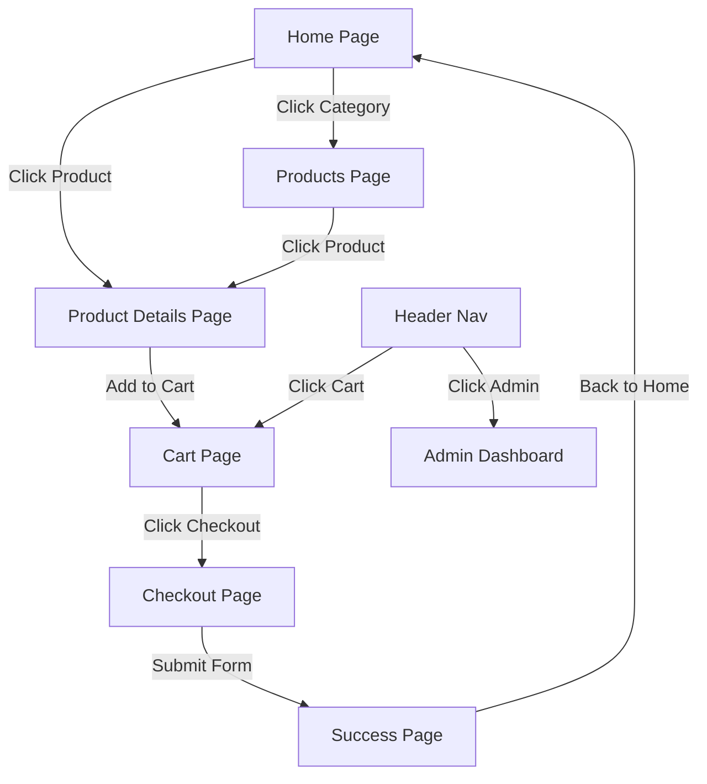
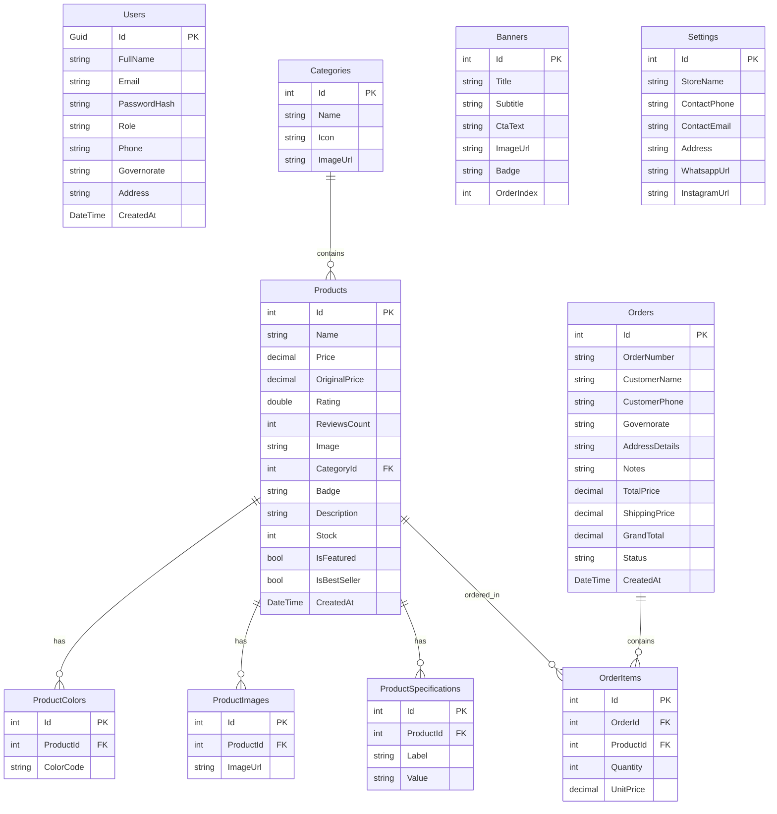

# Technical Analysis Report - Premium Arabic E-commerce Store

This report provides a detailed analysis of the existing frontend codebase, mapping the pages, components, navigation flow, state management, and defining the precise backend, API, and database schemas required to connect the system to a live production-ready backend.

---

## 1. Frontend Codebase Scan Summary

- **Framework**: Vite + React + TypeScript + Tailwind CSS.
- **Core Entry Points**:
  - `src/main.tsx` (Bootstraps the React application).
  - `src/app/App.tsx` (Contains all router logic, main state configurations, and page templates).
  - `src/styles/` (Includes global styling, shadcn custom theme, and Tailwind configurations).
- **Reusable Component Libraries**:
  - **Shadcn UI**: Primitive components built on top of Radix UI and Tailwind CSS are housed in `src/app/components/ui/` (48 files total, including Buttons, Cards, Inputs, Select, Dialogs, Tables, and Charts).
  - **Figma Utilities**: `ImageWithFallback.tsx` in `src/app/components/figma/` handles image load failures.
- **Brand Style System**:
  - Gold Accent: `#D4AF37` (`GOLD`)
  - Light Gold: `#E6D3A3` (`LIGHT_GOLD`)
  - Deep Dark Background: `#0F0F0F` (`BG`)
  - Card Fill: `#1A1A1A` (`CARD`)
  - Dark Sidebar Background: `#080808` (`DARK_BG`)
  - Typography: Cairo and Tajawal fonts loaded via Google Fonts.

---

## 2. Page Directory

The React application uses a state-driven router defined by `type Page = "home" | "categories" | "products" | "product" | "cart" | "checkout" | "success" | "admin"` in `App.tsx`.

1. **Home Page (`home`)** - `HomePage` Component:
   - Dynamic Hero Slider displaying promotional banners.
   - Quick Category Navigation slider.
   - Special promo ribbon with newsletter subscription.
   - Latest and Best Seller product grids.
   - Brand trust highlights (free shipping threshold indicator, quality guarantee, easy returns).
2. **Categories Page (`categories`)** - `CategoriesPage` Component:
   - Sidebar with Category Search and category buttons displaying count of items.
   - Visual grid of categories utilizing Unsplash background cover images.
3. **Products Page (`products`)** - `ProductsPage` Component:
   - Full catalog layout showing filtered product grids.
   - Category filter tabs at the top.
   - Dropdown sorting selector (Default, Price: Low to High, Price: High to Low, Top Rated).
4. **Product Details Page (`product`)** - `ProductDetailsPage` Component:
   - Image gallery with active thumbnail switching.
   - Promotional badges, stock status indicators, pricing, original price, and automatic discount calculation.
   - Interactive Color palette selector (hex code selection) and Quantity counter.
   - Tabbed section switching between description text and specification tables.
   - "Related Products" recommendation grid at the bottom.
5. **Cart Page (`cart`)** - `CartPage` Component:
   - Itemized cart grid with thumbnail, item name, price, quantity adjustments, and remove actions.
   - Order summary box calculating subtotal, free shipping threshold (500 EGP), and grand total.
6. **Checkout Page (`checkout`)** - `CheckoutPage` Component:
   - Delivery details form (Full Name, Phone Number, Governorate select dropdown, Address, Special notes).
   - Cash on Delivery (COD) payment method container.
   - Itemized order preview panel.
7. **Success Page (`success`)** - `SuccessPage` Component:
   - Large checkmark animation, Order Number display, delivery expectation card.
   - WhatsApp direct chat helper button and "Back to Home" button.
8. **Admin Dashboard (`admin`)** - `AdminDashboard` Component:
   - Tabbed Sidebar: Overview, Orders, Products, Categories, Banners, Settings.
   - **Overview**: Sales metrics (Total Sales, Today's Orders, Customers, Products count), 7-day sales graph, and category breakdown.
   - **Orders**: Listing table showing customer name, total, status tags (Processing, Shipping, Completed, Cancelled), and date.
   - **Products**: Table of products with add, edit, and delete dialog modals.
   - **Categories / Banners / Settings**: Management views to configure categories, slides, and store contact info.

---

## 3. Reusable UI Components

- **Header Component**: Shared website navigation bar. Houses Logo, page links, search field, shopping cart indicator with badge count, and Admin entry hook.
- **Footer Component**: Standard footer. Displays store metadata, social icons, newsletter sign-up, and page quick-links.
- **ProductCard Component**: Standard product card rendering price, badge, title, image, and action buttons ("Add to Cart" and "View Details").
- **HeroSlider Component**: Handles home page promotional slide animation and text styling.
- **SectionTitle Component**: Premium heading component with sub-title text and gold underline gradient.
- **StarRating Component**: Small utility to render gold stars dynamically according to rating metrics.

---

## 4. Navigation Flow

---

## 5. State Management & Connectivity Requirements

Currently, `App.tsx` maintains all application states in memory using React hooks:
- `page`: active screen string.
- `cart`: array of `{ product: Product, quantity: number }`.
- `product`: current details focus.
- `orderNum`: randomized order string.

### Connectivity Requirements (Frontend-to-Backend Integration)
To hook this frontend to our .NET Core backend, we must:
1. **HttpClient Layer**: Implement a standard Axios wrapper or fetch utility with interceptors to inject JWT bearer authentication tokens when accessing admin endpoints.
2. **API Service Modules**: Create clean TypeScript services to fetch live backend data:
   - `authService.ts`: Login (`/api/auth/login`) and Register (`/api/auth/register`).
   - `productService.ts`: Fetch products (`/api/products`), search/filter, and CRUD operations.
   - `categoryService.ts`: Fetch categories (`/api/categories`) and CRUD operations.
   - `orderService.ts`: Create order (`/api/orders`) and update status.
   - `bannerService.ts`: Fetch slides (`/api/banners`) and edit configurations.
   - `settingService.ts`: Get config (`/api/settings`) and update contact/whatsapp urls.
   - `dashboardService.ts`: Get analytical statistics (`/api/dashboard/stats`).
3. **State Integration**: Swap static mock arrays (`PRODUCTS`, `CATEGORIES`, `HERO_SLIDES`) in `App.tsx` with asynchronous `useEffect` fetches loading from endpoints, keeping styling and layouts intact.

---

## 6. Backend API Design Requirements

All endpoints will be RESTful and return JSON format:

### Authentication Module
- `POST /api/auth/register` (Register customer/admin)
- `POST /api/auth/login` (Returns JWT token + User Info)

### Products Module
- `GET /api/products` (Accepts queries: `search`, `categoryId`, `minPrice`, `maxPrice`, `sortBy`, `isFeatured`, `isBestSeller`, `pageIndex`, `pageSize`)
- `GET /api/products/{id}` (Returns full details with specification list)
- `POST /api/products` (Create new product - Admin only)
- `PUT /api/products/{id}` (Update product details - Admin only)
- `DELETE /api/products/{id}` (Delete product - Admin only)

### Categories Module
- `GET /api/categories` (Fetch categories list with counts)
- `POST /api/categories` (Create category - Admin only)
- `PUT /api/categories/{id}` (Update category - Admin only)
- `DELETE /api/categories/{id}` (Delete category - Admin only)

### Orders Module
- `POST /api/orders` (Submit checkout order with items, reduces inventory)
- `GET /api/orders` (List all orders - Admin only)
- `GET /api/orders/{id}` (Get order by ID)
- `PUT /api/orders/{id}/status` (Update order status - Admin only)

### Banners Module
- `GET /api/banners` (Get slides for home slider)
- `POST /api/banners` (Create banner - Admin only)
- `PUT /api/banners/{id}` (Update banner - Admin only)
- `DELETE /api/banners/{id}` (Delete banner - Admin only)

### Settings Module
- `GET /api/settings` (Get store-wide email, phone, location, WhatsApp, Instagram links)
- `PUT /api/settings` (Update settings - Admin only)

### Dashboard Statistics Module
- `GET /api/dashboard/stats` (Fetch total sales, today's order count, user count, product count, sales history array, and category percentages - Admin only)

### Cloudinary Integration Module
- `POST /api/images/upload` (Uploads product image file, returns secure Cloudinary URL)

---

## 7. Database Requirements (Entity-Relationship)

We will use SQL Server mapped via Entity Framework Core:

